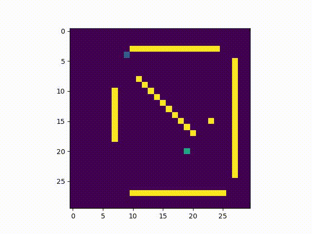
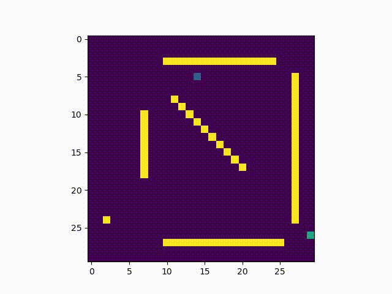
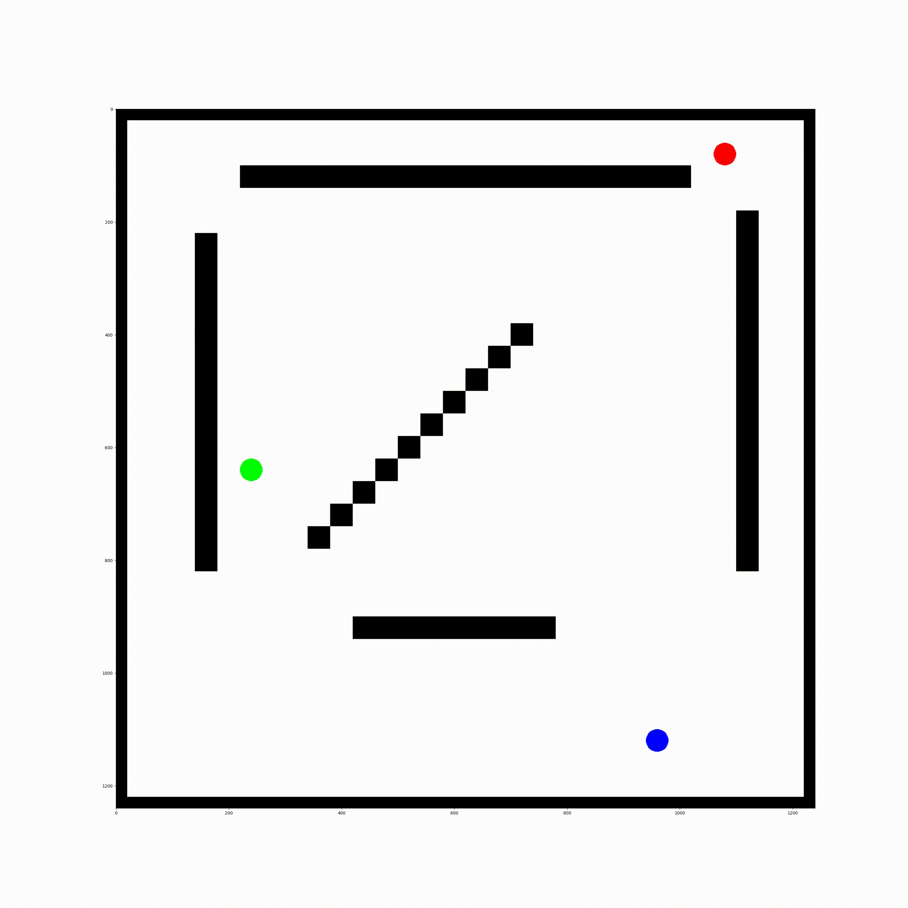
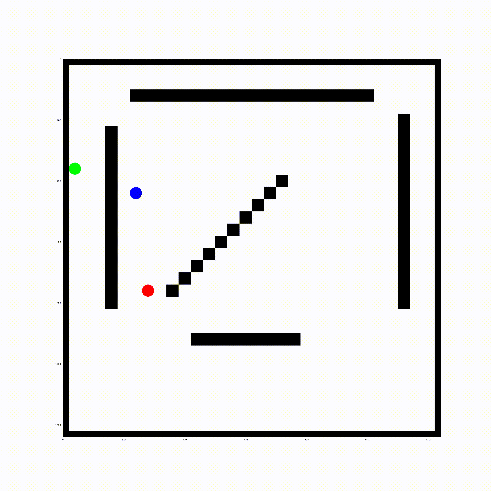
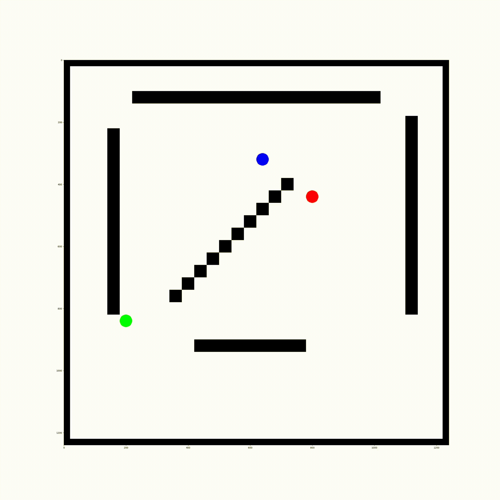

### Evader-pursuer zero-sum game by MCTS

MCTS policy examples

<table style="width:100%; table-layout:fixed;">
  <tr>
    <td></td>
    <td></td>
  </tr>

    <tr>
    <td></td>
    <td></td>
  </tr>

    <tr>
    <td></td>
    <td></td>
  </tr>

</table>
